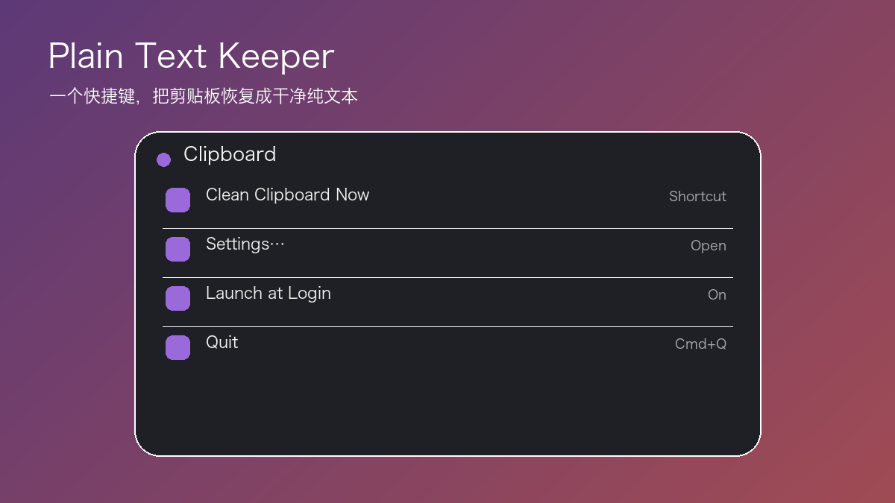

<p align="center"></p>

<h1 align="center">Plain Text Keeper</h1>
<p align="center">一个快捷键，把剪贴板恢复成干净纯文本。</p>

<p align="center">
  
  
  
</p>

## 为什么好用

- 默认按下 `Control + Option + Command + V` 清除当前剪贴板格式。
- 只处理你刚复制的文本：不轮询、不监控，也不会自动粘贴。
- 没有文本时保持剪贴板不变，并播放系统提示音。
- 菜单栏常驻、无 Dock 图标，可自定义快捷键和开机启动。

## 安装与使用

从 [GitHub Releases](https://github.com/ORDOABCHAOWT/plain-text-keeper/releases) 下载 App 并放入“应用程序”。复制富文本，按快捷键，再像平常一样粘贴即可。

## 开发与验证

```bash
Tests/verify_settings_ui.sh
Tests/verify_launch_feedback.sh
INSTALL_APP=0 ./build.sh
```

`INSTALL_APP=0` 只生成 `dist/Plain Text Keeper.app`，不会替换已安装客户端。

## License

[MIT](LICENSE) © ORDOABCHAOWT
